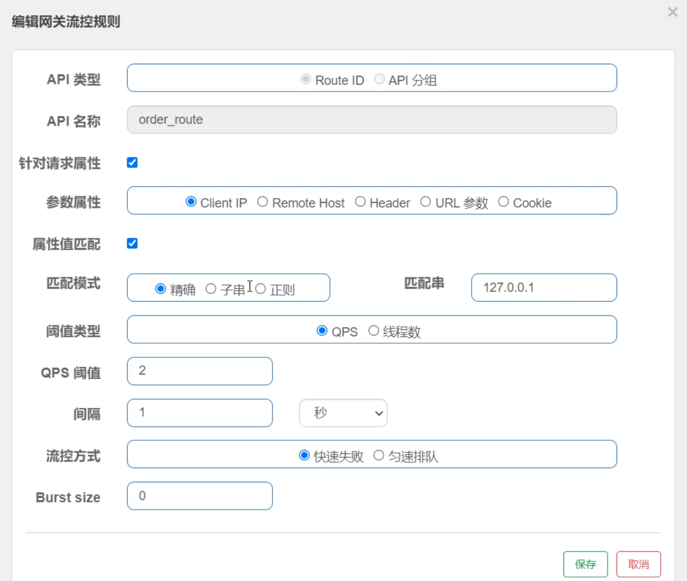

## Spring Cloud 2.0 - power by Alibaba

Spring Boot：2.3.12.RELEASE 

Spring Cloud：Hoxton.SR12

Spring Cloud Alibaba：2.2.7.RELEASE


### Nacos

动态服务发现、配置、动态 DNS 等一体的软件。

#### 部分功能原理

参考连接：https://mp.weixin.qq.com/s/tgWGMqs-ppM6p4hxUpIdcg

##### 永久实例

临时实例被放入内存中的服务注册表中，永久实例会被保存到磁盘

##### 注册机制

1.x 通过 http 连接的方式发送数据 2.x 通过 gRPC 保持长连接发送信息（临时实例：将实例信息存到客户端）

##### 心跳机制

只有临时实例需要心跳机制确认状态

1.x 每 5s 发送心跳，服务端每 5s 检查一次最后时间 >15s 不健康  > 30s 剔除

2.x 长连接是否断开，服务端每 3s 检查 20s 没有发消息的连接，主动发送请求检测状态

##### 健康检查

永久实例（如 MySQL）不会发送心跳，服务段在 2~7s 主动进行检测（TCP 检查端口、HTTP 发送请求、MySQL 执行语句）

##### 更新推送

1.x 启动订阅服务，建立一个 udp 的端口连接后，服务器推送数据后缓存。开启一个不定时（<60s）的查询，对比缓存（避免 UDP 的不稳定）

2.x 长连接直接推到客户端，不定时查询对比功能默认关闭

##### 数据一致性

**Nacos 的 AP 和 CP 是取决于内部具体功能，而不是通过配置切换**。临时：优先可用性（AP）永久：优先一致性（CP）

AP：使用 Distro 协议，各个节点的数据是一致的。**失败重试和定时对比**保证高可用

CP：使用 JRaft 协议，在写入数据时从 Leader 写入（Leader 会想检测超过半数的节点能写入成功才写入，保证一致性）


#### 常用级别

1. 命名空间：用以进行服务大的分类，如进行项目分类

2. 分组：对服务进行小的分组，如 dev prod 环境区分

3. 元数据：以服务进行自定义的数据，会直接下发到服务（需要自行适配处理）

4. 保护阈值：值：0~1，当服务的可用比例超过保护阈值的情况下，整个服务不可用

5. 临时实例：ephemeral: true / false，永久实例：即使服务不可用依旧会被调用到（作用：永久实例关注状态 MySQL等）

   临时实例保存在注册中心的注册表，永久实例会持久化到磁盘

6. 权重：手动分配各个服务节点的使用比例

#### 注册中心

1. 直接下载 nacos-windows.zip 解压
2. 使用命令 /bin/startup.cmd -m standalone 启动 nacos 服务（普通模式需要配置数据库）
3. 使用 IP:8848 访问页面，账号：nacos nacos

#### 提供者

1. 引入 spring-cloud-starter-alibaba-nacos-discovery 包
2. 配置 spring.cloud.nacos.discovery.server-addr: 10.11.200.54:8848 和 spring.application.name 指定服务的名称
3. 使用 @EnableDiscoveryClient 注解，打开服务发现功能
4. 启动后可以在 nacos 看到指定的服务

#### 消费者

1. 前三步，同上
2. 使用 RestTemplate.getForObject("http://{服务名称}/URI", RESPONSE.class) 即可调用远程服务

#### 配置方

1. 再引入 spring-cloud-starter-alibaba-nacos-config 包
2. 新增 bootstrap.yml 配置文件（用以基础配置 spring.application.name nacos 等）
3. 新增 application.yaml 指定配置文件等级 spring.profiles.active: dev
4. 在 nacos 上新增 {name}-dev.yaml 配置文件，并填入配置
5. 直接使用 @Value("${xxx}") 即可引用配置项，并会自动更新


### Ribbon & LoadBalancer

ribbon 因为停止维护，现都优先采用 loadbalancer 组件

常用的负载均衡算法：

1. RandomRule 随机
2. RoundRobinRule 轮询
3. RetryRule 轮询重试
4. WeightedResponseTimeRule 响应时间权重
5. BestAvailableRule 最佳负载
6. ZoneAvoidanceRule 地区（默认）

#### 替换负载策略

1. 创建一个 bean 返回 IRule 的一个实现类
2. 指定服务的负载策略：微服务名.ribbon.NFLoadBalancerRuleClassName = 完整类名


### OpenFeign

用以通过直接以本地方法的方式调用微服务的接口

#### 使用

1. 引入 spring-cloud-starter-openfeign 包
2. 在启动类上新增 @EnableFeignClients 注解，打开服务
3. 创建一个接口指定对应微服务的接口，使用 @FeignClient(value = "微服务名称", path="/controller") 注解
4. 在接口中创建方法声明（要与微服务中的一致，@PathVariable 必须指定名称）

#### 服务日志打印

默认的日志信息的级别是 debug ，需要在配置文件中修改指定包 or 类的日志等级

1. 全局配置类：配置一个 bean 返回 feign.Logger.Level.（NONE / BASIC/ HEADER / FULL）
2. 局部配置：新增 @FeignClient( configuration = FeignConfig.class )
3. 配置文件：feign.client.config.微服务名称.loggerLevel

#### 兼容之前的 Feign 的注解

1. 全局配置类：配置一个 bean 返回 Contract.Default();
2. 配置文件：feign.client.config.微服务名称.contract=feign.Contract.Default

#### 超时时间配置

1. 全局配置类：配置一个 bean 返回 Request.Options(5000, 10000)，1.连接时间 2.超时时间
2. 配置文件：feign.client.config.微服务名称.connectionTime \ readTimeout

#### 自定义拦截器

如果需要在请求微服务之前做某些操作，可以通过拦截器实现

1. 实现接口：RequestInterceptor.apply ，并创建 bean 返回实例
2. 配置文件：feign.client.config.微服务名称.requestInterceptors[0] = 完整类名


### Nacos-config

**维护性：**用以进行配置和程序的分离，微服务可能出现组件伸缩的情况，配置和程序绑定更新起来太麻烦

**时效性：**定时10ms对比配置中心与本地的版本（md5）是否匹配，同步效率很高

**安全性：**可以进行环境划分，比如 dev 、pro 的环境分隔等

可以严格的权限划分，比如开发人员只能访问 dev 环境等

#### 长轮询机制

1. 客户端定时发送检查配置更新的请求
2. server 收到请求后检查是否有配置更新，**若没有则设置一个定时任务，放入请求到等待队列中**
3. 当配置发生变化时会检查等待队列中的请求，符合则发送到 client
4. 若达到超时时间都未更新，则返回未更改的结果给 client

**优点：**把等待的时间延长，减少请求的次数


#### 权限控制

需要在 nacos 的配置文件中将 nacos.core.auth.enable=true 打开权限控制功能

#### 默认配置

1. 在 nacos 配置中心直接新增一个名为 ${spring.application.name} 的配置（默认 .properties）
2. 在程序中使用 bootstrap.yml 配置 nacos 地址、微服务名称等**基础信息**
3. 在程序中即可读取相关配置的值

##### 配置文件类型

在使用非 .properties 的类型配置时，**需要在 Data Id 上指定使用的文件类型**。

如：order-server.yaml

##### 指定环境配置

1. ${spring.application.name}-\${profile}.{file-extension}   如：order-server-dev.yaml

2. 修改配置：spring.cloud.nacos.config.file-extension: yaml

##### Namespace & Group

最佳实践： Namespace 用以生产环境区分，Group 用以项目区分

spring.cloud.nacos.config.namespace 指定对应的命名空间

spring.cloud.nacos.config.group 指定对应的项目

##### 使用 @Value 访问

默认情况下无法感知到修改后的配置，需要在使用的 @value 访问配置的类上新增 @RefreshScope 注解

#### 配置优先级

**profile > 默认配置 > extension-configs > shared-configs（下标越大越优先）**

1. edr-dev.yaml 	         精准环境配置（环境）
2. edr.yaml                     同工程不同环境的通用配置（通用）
3. edr-618-redis.yaml   不同工程的扩展配置（大促）
4. edr-redis.yaml           不同工程的通用配置（公共组件）

#### 自定义扩展 Data Id 配置

默认的配置（以微服务名称做为 Data Id）不能满足引用公共组件（redis 等）配置的情况

```yaml
spring:
  cloud:
    nacos:
      config:
        extension-configs:
          - data-id: aliyun-redis.yaml
            group: ALIYUN_EDR
            refresh: true
      	sharded-configs:
      	  - data-id: aliyun-redis.yaml
      	    group: ALIYUN_EDR
      	    refresh: true
```


### Sentinel

是面向分布式的高可用**流量控制**组件，主要用于流量控制、熔断降级、系统负载保护等帮助用户保护服务的稳定性


#### 控制中心

1. 下载 sentinel-1.8.6.jar 文件到本地
2. 直接使用 java -jar sentinel-1.8.6.jar 启动 sentinel 服务
3. 使用 IP:8080 访问页面，使用 sentinel\sentinel 账号登录

#### 资源方

资源：进行流量控制的最小单元，可以是一个类、方法、一段代码等

1. 引入 spring-cloud-starter-alibaba-sentinel 包
2. 新增 spring.cloud.sentinel.transport.dashboard \ port 配置项
3. 创建一个 RESTful 接口

##### 自动扫描

支持对主流 web 框架的 url 资源自动扫描，并将其自动定义为资源。

Web Servlet、Dubbo、Spring Cloud、gRPC、Spring WebFlux 和 Reactor 等

##### 使用 SphU 定义

SphU 使用 try-catch 的方式定义资源，即：如果资源进行降级则抛出 BlockException 异常

```java

Entry entry = null;
try {
    entry = SphU.entry("资源名称");
    // TODO 一些业务处理
} catch (BlockException ex) {
    LOG.info("被降级啦");
} finally {
    if (entry != null) {
        entry.exit();
    } 
}
```

##### 使用 SphO 定义

SphO 是用 if-else 的方式定义资源，即：如果资源降级则返回 false 

```java
if (SphO.entry("资源名称")) {
    try {
        // TODO 一些业务处理
    } finally {
        // 资源必须被释放
        ShpO.exit();
    }
} else {
    LOG.info("被降级啦");
}
```

##### @ResourceSentinel（推荐）

```java
@ResourceSentinel(value = "资源名称")
public String getUserName();
```

#### 流量控制

##### 控制台创建规则

1. 在控制中心左侧找到服务，后点击簇点链路，找到定义的**资源名称**
2. 点击后方的流控按钮
3. 阈值类型：QPS \ 并发线程数
4. 单机阈值：2
5. 流控模式：直接 \ 关联 \ 链路 
6. 流控效果：快速失败 \ Warm up(预热) \ 排队等待
7. 指定限流的处理方法：@ResourceSentinel(blockHandler = "getUsernameBlockHandler" ) 
8. 创建的处理方法：**1.public 2.返回类型和资源方法一致 3.参数上新增 BlockException 4.非同类指定 static**

##### 代码创建

```java
private static void initFlowRules() {
    FlowRule rule = new FlowRule();
    rule.setResource("getUsername");
    rule.setGrade(RuleConstant.FLOW_GRADE_QPS);
    rule.setCount(2);
    
    // 添加限流规则
    FlowRuleManager.loadRules(Collections.singleton(rule));
}
```


#### 熔断降级

熔断状态转换：

重点：熔断开启 **-- 熔断时长 -->** 探测恢复状态 **-- 请求成功 -->** 熔断关闭


##### 控制台创建规则

1. 找到资源名称后的熔断按钮
2. 熔断策略：慢调用比例 \ 异常比例 \ 异常数
3. 异常数：2
4. 熔断时长：5s
5. 最小请求数：2
6. 统计时长：1000ms
7. 指定降级处理方法：@ResourceSentinel( fallback = "getUsernameFallbackHandler" )
8. 创建降级方法：**1.public 2.返回类型和资源方法一致 3.参数上新增 BlockException 4.非同类指定 static**

##### 代码创建

```java
private static void initDegradeRule() {   
    DegradeRule rule = new DegradeRule("getUsername");
    rule.setGrade(CircuitBreakerStrategy.ERROR_RATIO.getType());
    rule.setCount(0.7);
    rule.setMinRequestAmount(100);
    rule.setStatIntervalMs(30000);
    rule.setTimeWindow(10);

    DegradeRuleManager.loadRules(Collections.singleton(rule));
}
```

#### 系统保护

设置 CPU 的占用比例阈值，以保证程序稳定运行

#### 授权规则

通过设置黑白名单来保护资源是否可以被调用

#### 热点参数限流

对访问频次高的数据源进行调用次数的限制

#### 规则持久化

1. 引入 sentinel-datasource-nacos 包，指定其配置中心为 nacos

2. 在 nacos 中新增配置项，指定流控的资源和属性

   | Field           | 说明                                                         | 默认值                        |
   | --------------- | ------------------------------------------------------------ | ----------------------------- |
   | resource        | 资源名，资源名是限流规则的作用对象                           |                               |
   | count           | 限流阈值                                                     |                               |
   | grade           | 限流阈值类型，1.QPS 模式 0.并发线程数模式                    | QPS 模式                      |
   | limitApp        | 流控针对的调用来源                                           | `default`，代表不区分调用来源 |
   | strategy        | 调用关系限流策略：0.直接、1.链路、2.关联                     | 根据资源本身（直接）          |
   | controlBehavior | 流控效果（0.直接拒绝 / 1.WarmUp / 2.匀速 + 排队等待），不支持按调用关系限流 | 直接拒绝                      |
   | clusterMode     | 是否集群限流                                                 | 否                            |

   ```json
   [
       {
           "source": "/order/buy",
           "count": 2,
           "grade": 1,
           "limitApp": "default",
           "strategy": 0,
           "controlBehavior": 0,
       }
   ]
   ```

3. 在应用的资源上配置 nacos 配置中心

   ```yaml
   spring:
     cloud:
     	sentinel:
     		datasource:
     			flow-rule: # 这个名称可以随意
     				nacos:
                       server-addr: 10.11.200.52:8848
                       username: nacos
                       password: nacos
                       data-id: order-service-flow-rule
                       # 指定规则的类型
                       rule-type: flow、degrade、param-flow、system、authority、gw-flow、gw-api-group
   ```


### Seata

分布式事务的解决方案，用在需要强一致性的场景下（如：生成订单 -> 扣库存 -> 扣余额）

官方文档：https://seata.apache.org/zh-cn/docs/overview/what-is-seata

#### 事务模式

##### AT 模式

**前提：**必须要使用支持 ACID 的数据 和 JDBC 访问

工作机制：

1. 开启本地事务，处理业务数据 和 **回滚日志记录（undo_log）**，释放本地锁和连接资源
   1. 通过解析业务 sql 获取受影响前的数据（before images）
   2. 执行业务 sql 
   3. 获取受影响后的数据（after images）
2. 在取得受影响业务数据的全局锁后，提交本地事务（未获得就不能提交）
3. 等待事务内的其他处理完成
4. 全局事务提交：
   1. 把请求放入异步队列，马上返回提交成功的结果给 TC
   2. 异步和批量删除 UNDO LOG 记录
5. 全局事务回滚：
   1. 开启本地事务，通过 XID 和 Branch ID 查找到对应的 undo_log 记录
   2. 校验 after image 和当前数据是否一致（不一致则被其他修改过，需要恢复）
   3. 根据 before image 和业务 sql 生成回滚语句
   4. 执行回滚语句，并将回滚结果返回给 TC

写隔离：（多个数据处理相同数据）

- 本地事务提交之前，必须**确保拿到全局锁**才能提交
- 在指定范围内都未获取到全局锁，则进行本地事务回滚并释放本地锁（避免死锁）

读隔离：

​	当前 Seata 默认的全局隔离的级别是：读未提交（可能读到未全局提交的数据）

​	若需要控制为：读已提交级别，则采用 SELECT XXXX FOR UPDATE 方式

	1. 当执行 SELECT xx FOR UPDATE 语句的时候，会尝试获取**全局锁**
	2. 其他事务正在使用全局锁，那么查询就会被 BLOCK 住，直到拿到全局锁后，读取数据后返回

##### TTC 模式

AT 模式 = **Automatic** transcation mode 自动模式，必须要数据库支持 ACID 的事务（系统提供 commit rollback）

而 TTC 模式就是自己指定 commit 和 rollback 处理方法，不依赖底层数据支持

使用：

```java
/**
* 本地的 Bean 需要用 @LocalTCC
*/
@LocalTCC
public interface TccActionTwo {
    
    @TwoPhaseBusinessAction(name = "TccActionTwo", commitMethod = "commit", rollbackMethod = "rollback")
    public boolean prepare(BusinessActionContext actionContext, @BusinessActionContextParameter(paramName = "a") String a);
    
    public boolean commit(BusinessActionContext actionContext);
    
    public boolean rollback(BusinessActionContext actionContext);
}
```

##### SAGE 模式

主要用以业务流程长、流程多，参与者包含其他公司 or 遗留系统业务（无法提供 TCC）

##### XA 模式

由实现了 XA 规范的框架来代替数据库的事务支持，只需要使用 DataSourceProxyXA() 来替代数据源即可


#### 启动服务

1. 下载 seata-server-2.0.0.zip 文件后解压

2. 指定 seata 的 config register store 配置

   ```yaml
   seata:
     config:
       type: nacos
       nacos:
         server-addr: 10.11.200.54:8848
         namespace:
         group: SEATA_GROUP
         username: nacos
         password: nacos
         context-path:
         data-id: seataServer.properties
     registry:
       type: nacos
       nacos:
         application: seata-server
         server-addr: 10.11.200.54:8848
         group: SEATA_GROUP
         namespace:
         cluster: default
         username: nacos
         password: nacos
         context-path:
     store:
       mode: db
       db:
         datasource: druid
         db-type: mysql
         driver-class-name: com.mysql.jdbc.Driver
         url: jdbc:mysql://10.11.1.10:3306/spring-cloud?rewriteBatchedStatements=true
         user: root
         password: mysql
         min-conn: 10
         max-conn: 100
         global-table: global_table
         branch-table: branch_table
         lock-table: lock_table
         distributed-lock-table: distributed_lock
         query-limit: 1000
         max-wait: 5000
   ```

3. 直接运行 seata-server.bat 启动服务


#### 上传配置到 nacos 中心

1. 在 /Seata/script/config-center/conf.txt 中包含详细的事务管理的配置项
2. 使用 sh nacos-config.sh -h ${nacos.IP} -p \${nacos.PORT}  -g SEATA_GROUP -u nacos -w nacos 上传这些配置到注册中心去


#### 事务分组

事务分组是 Seata 提供的一种 TC（Seata Server） 服务查找机制

Seata 通过事务分组获取 TC 服务，流程如下：

1. （Seata-Client）在应用中配置事务分组。

   例：service.vgroupMapping.order-service-group=default（事务分组：order-service-group TC集群：default）

2. （Seata-Client）通过配置中心去查找配置：`service.vgroupMapping.{事务分组}`，该配置的值就是 TC 集群的名称。例：default

3. 获得集群名称后，应用通过一定的前后缀 + 集群名称去构造服务名。

   例：spring.cloud.alibaba.seata.tx-service-group: order-service-group

4. 得到服务名后，去注册中心去拉取服务列表，获得后端真实的 TC 服务列表

   例：通过 TC 集群名称获取到 Seata-Server 的微服务


#### 集成项目

1. 引入 spring-cloud-starter-alibaba-seata 包

2. 新增 seata 的其他配置

   ```yaml
   # seata
   seata:
     application-id: ${spring.application.name}
     tx-service-group: order-service-group
     service:
       grouplist:
         seata-server: 10.11.200.54:8091
     registry:
       type: nacos
       nacos:
         server-addr: 10.11.200.54:8848
     config:
       type: nacos
       nacos:
         server-addr: 10.11.200.54:8848
   ```

3. 使用 @GlobalSentinel 注解在需要使用分布式事务的方法上

回滚日志记录：

```
Begin new global transaction [10.11.200.54:8091:802104847780110346]

rm handle branch rollback process:xid=10.11.200.54:8091:802104847780110346,branchId=802104847780110347,branchType=AT,resourceId=jdbc:mysql://10.11.1.10:3306/spring-cloud,applicationData=null

Branch Rollbacking: 10.11.200.54:8091:802104847780110346 802104847780110347 jdbc:mysql://10.11.1.10:3306/spring-cloud

xid 10.11.200.54:8091:802104847780110346 branch 802104847780110347, undo_log deleted with GlobalFinished

Branch Rollbacked result: PhaseTwo_Rollbacked
```


### Gateway

基础见 1.0 的 Spring Cloud Gateway

#### 集成 Sentinel 进行网关流控

1. 引入 spring-cloud-alibaba-sentinel-gateway 包

2. 在 gateway 项目配置中新增 sentinel 地址

   ```yaml
   sentinel:
     transport:
       dashboard: 10.11.200.54:8080
   ```

3. 配置路由流控规则

   

4. 指定降级返回信息

   配置文件：

   ```yaml
   spring:
     cloud:
       sentinel:
         scg:
           fallback:
             mode: response
             response-body: "{'code': 403, 'message': '当前服务器忙！‘}"
   ```

   自定义配置：

   ```java
   @Configuration
   public class GatewayConfig {
       
       @PostConstruct
       public void init() {
           BlockRequestHandler blockHandler = new BlockRequestHandler() {
               @Override
               public Mono<ServerResponse> handlerRequest(ServletWebExchange ex, Throwable th) {
                   return ServerResponse
                       .status(HttpStatus.OK)
                       .contentType(MedieType.APPLICATION_JSON)
                       .body(BodyInserters.fromValue("当前服务器忙"));
               }
           };
           
           GatewayCallbackManager.setBlockHandler(blockHandler);
       }
   }
   ```

5. 自动创建规则

   ```java
   public class GatewayRuleConfig {
       
       @PostConstruct
       public void init() {
           initRule();
       }
       
       public void initRule() {
           Set<GatewayFlowRule> rules = new HashSet<>(1);
           // 指定网关名称、限流数、统计时间
           rules.add(new GatewayFlowRule("order_route")
                     .setCount(2)
                     .setIntervalSec(1));
           
           // 加载限流规则
           GatewayRuleManager.loadRules(rules);
       }
   }
   ```

#### 高可用

1. 启动多个 Gateway 实例
2. 使用 Nginx 反向代理到多个实例即可


### SkyWalking

用以进行微服务之间的调用链路追踪、日志上报、状态告警等

#### 安装服务

1. 到 skywalking 官网下载最新的 apm 包，并解压
2. 修改 webapp/application.yml 中的 serverPort=8081（默认为：8080 会被占用）
3. 运行 bin/startup.bat 即可运行服务（有两个窗口 oap 采集程序和 webapp 程序）

#### 终端追踪

1. 在运行的 jar 包时新增 vm 启动参数

   ```txt
   -javaagent:D:\2-Tools\skywalking-agent\skywalking-agent.jar
   -DSW_AGENT_NAME=order-service
   -DSW_AGENT_COLLECTOR_BACKEND_SERVICES=127.0.0.1:11800
   ```

2. 正常启动 spring boot 即可

3. 默认情况下：gateway 不会被链路追踪到，需要在 agent 下的 plugins 中新增 apm-spring-cloud-gateway-xxx.jar

4. 在需要追踪的微服务都加 vm 参数，才可追踪到微服务之间的调用

#### 数据持久化

默认情况下采用的 h2 数据库保存，链路追踪的数据（在内存中会越来越大~）

1. 在服务器的 config/application.yml 修改 storage.selector: ${SW_STORAGE: mysql}
2. 然后修改 storage.mysql 下的 mysql 地址、数据库、用户名和密码即可
3. **添加 mysql-connector 驱动包到服务器的 lib 目录下**
4. 重新启动 startup.bat 会自动创建 skywalking 所需要的所有表

#### 自定义 endpoint

endpoint 是追踪的最小单位，可以进行自定义追踪点（比较重要的方法）

1. 引入 apm-toolkit-trace.9.1.0（版本和 agent.jar 相同）

2. 在需要追踪的方法上新增 @Trace @Tags 注解

   ```java
   @Override
   @Trace
   @Tags({
       @Tag(name = "userId", value = "arg[0]"),
       @Tag(name = "userInfo", value = "returnedObj")
   })
   public User getUserInfo(Integer userId){
       return baseMapper.selectByKey(userId);
   }
   ```


#### 性能分析

在某个 service 中的 Trace Profiling （链路追踪）中可以针对 endpoint 进行创建某一时段的监控任务，用以分析其链路上的耗时节点

#### 日志

##### 本地日志打印

可以在日志中记录追踪的 trace id ，方便后续在页面中对此条链路进行定位查看

1. 在 logback-spring.xml 文件中的 \<Pattern> 标签下新增 [%tid] 参数打印即可

##### 上传日志到服务器

1. 引入 apm-toolkit-loback-1.x 的 jar 包

2. 在 logback-spring.xml 中新增 appender 即可在服务器看到上传的日志

   ```xml
       <appender name="grpc-log" class="org.apache.skywalking.apm.toolkit.log.logback.v1.x.log.GRPCLogClientAppender">
           <encoder class="ch.qos.logback.core.encoder.LayoutWrappingEncoder">
               <layout class="org.apache.skywalking.apm.toolkit.log.logback.v1.x.mdc.TraceIdMDCPatternLogbackLayout">
                   <Pattern>%d{yyyy‐MM‐dd HH:mm:ss.SSS} [%X{tid}] [%thread] %-5level %logger{36} ‐%msg%n</Pattern>
               </layout>
           </encoder>
       </appender>
   ```


#### 发送告警

SkyWalking 提供 config/alarm-settings.yml 文件，里面预先定义了一些常用的告警规则。如下：
1. 过去 3 分钟内服务平均响应时间超过 1 秒。
2. 过去 2 分钟服务成功率低于80%。
3. 过去 3 分钟内服务响应时间超过 1s 的百分比
4. 服务实例在过去 2 分钟内平均响应时间超过 1s，并且实例名称与正则表达式匹配。
5. 过去 2 分钟内端点平均响应时间超过 1 秒。
6. 过去 2 分钟内数据库访问平均响应时间超过 1 秒。
7. 过去 2 分钟内端点关系平均响应时间超过 1 秒。

##### Webhook（网络钩子）

当 SkyWalking 产生一条告警会回调指定的 hook 地址（有 webhook 微信 钉钉 飞书等）

将告警的信息上报给指定的接口，

方法为 POST 

类型为 application/json 

数据为 org.apache.skywalking.oap.server.core.alarm.AlarmMessage


#### 高可用的实现

1. 修改集群注册中心 cluster.selector: nacos
2. 新增服务器的注册中心类型为 nacos 地址（也可以是集群，就为 nacos 的 nginx 地址）
3. 看情况修改端口地址，默认为 11800（服务端口） 12800（网页查询端口）
4. 在 webapp 中修改 listOfServer 为多个服务的端口，如 10.11.200.54:11800, 10.11.1.10:11800 